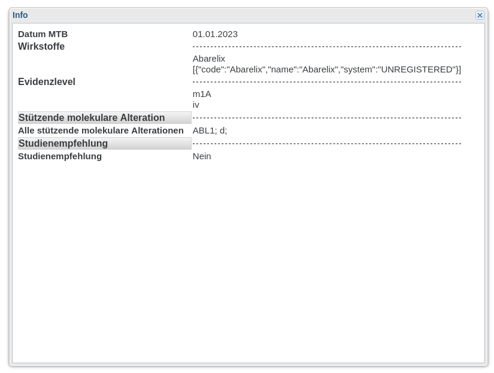

# Onkostar Plugin FormInfo

Dieses Onkostar-Plugin ermöglicht das Abfragen von Informationen über Formulare.

## Bereit gestellte Funktionen

### Backend-Methode `getContent()`

Das Plugin stellt die Methode `getContent()` bereit um den Inhalt eines Formulars bzw. einer Prozedur abzurufen.

Damit können zum Beispiel Inhalte eines Formulars bei einem Formularverweis abgerufen und mithilfe
eines Formularscripts in einem Dialog angezeigt werden.

#### Beispiel

Bei Aufruf in einem Formularscript wird den Inhalt des Formulars in diesem Beispiel in der Entwicklerkonsole ausgeben.

```javascript
executePluginMethod(
   'FormInfoPlugin',
   'getContent',
   { id: getFieldValue('referenceformfield').id },
   function (result) {console.log(result);},
   false
);
```

Beispiel für das zurückgegebene Ergebnis mit den Inhalten in `result`.

```json
{
  "status": {
    "code": 1,
    "exception": null,
    "message": "The method executed successfully."
  },
  "result": [
    {
      "field": "datum",
      "description": "Datum der Utersuchung",
      "value": "01.01.2023",
      "type": "INPUT"
    },{
      "field": "grpEvidenzlevel",
      "description": "Evidenzlevel",
      "value": null,
      "type": "GROUP"
    },{
      "field": "evidenzlevel",
      "description": "Evidenzlevel",
      "value": "m1A",
      "type": "INPUT"
    },{
      "field": "evidenzlevelzusatz",
      "description": "Evidenzlevel (Zusatz)",
      "value": "Z",
      "type": "INPUT"
    }
  ]
}
```

### Infodialog zur Nutzung in einem Formularscript mit der Methode `showFormContentInfo()`

Das Plugin stellt einen Dialog zur Nutzung in einem Formularscript mit der Methode showFormContentInfo()` zur Verfügung.

#### Beispiel

Das folgende Beispiel lädt einen simplen Dialog aus dem Plugin und zeigt die Inhalte des Formulars zu einem Formularverweis an.

```javascript
Ext.syncRequire('app.plugins.forminfo.FormInfoPlugin', () => {
    let FormInfoPlugin = Ext.ClassManager.get('FormInfoPlugin');
    if (FormInfoPlugin === null) {
        // ggf Warnung ausgeben
        return;
    }
    FormInfoPlugin.showFormContentInfo(this, 1234);
});
```



### Methode `getMainFormProcedureId()`

Das Plugin stellt die Methode `getMainFormProcedureId()` bereit um die ID eines Hauptformulars zu einem Unterformular zu ermitteln.

Mit diesem Wert ist es möglich, Informationen über das Hauptformular eines Unterformulars abzurufen.

#### Beispiel zur Nutzung in einem Formularscript

Es gibt zwei Möglichkeiten diese Methode zu nutzen.

Wenn Sie die in Onkostar verfügbare Funktion `executePluginMethod()` nutzen möchten, zeigt das nachfolgende Beispiel den Aufruf der entsprechenden Backend-Methode.

```javascript
executePluginMethod(
   'FormInfoPlugin',
   'getMainFormProcedureId',
   { id: 1234 },
   function (result) {console.log(result);},
   false
);
```

Das Plugin enthält auch eine eigene Methode in der bereit gestellten Frontend-Bibliothek.

Beachten Sie, dass die Callback-Funktion in diesem Fall nur dann ausgeführt wird, wenn die Anfrage an das Backend erfolgreich war und nur die ID an die Callback-Funktion übergeben wird. Im Fehlerfall wird eine Fehlermeldung geloggt.

```javascript
Ext.syncRequire('app.plugins.forminfo.FormInfoPlugin', () => {
    let FormInfoPlugin = Ext.ClassManager.get('FormInfoPlugin');
    if (FormInfoPlugin === null) {
        // ggf Warnung ausgeben
        return;
    }
    
    let callbackFunction = function(mainFormId) {console.log(mainFormId);};
    
    FormInfoPlugin.getMainFormProcedureId(this, getFieldValue('referenceformfield').id, callbackFunction);
});
```
## Verwendung in eigenen Plugins

Dieses Plugin stellt den Service `FormInfoService` zur Verfügung. Dieser kann auch in eigenen Plugins genutzt werden.

Zur Verwendung dieses Services muss das Plugin in der Onkostar-Installation installiert sein.

Legen Sie die JAR-Datei des Plugins im Projektverzeichnis `libs` ab und geben Sie folgende Abhängigkeit an:

```xml
<dependency>
    <groupId>de.ukw</groupId>
    <artifactId>onkostar-plugin-forminfo</artifactId>
    <!-- Version bei Update anpassen! -->
    <version>0.1.0</version>
    <scope>system</scope>
    <!-- Version bei Update anpassen! -->
    <systemPath>${project.basedir}/libs/onkostar-plugin-forminfo-0.1.0.jar</systemPath>
</dependency>
```

Sie können nun wie folgt in Ihrem Plugin auf die verfügbaren Methoden zugreifen:

```java

import org.springframework.beans.factory.annotation.Autowired;

class YourPlugin implements IProcedureAnalyzer {

    @Autowired
    private FormInfoService formInfoService;
    
    // ... weitere Angaben in Ihrem Plugin
    
    public void yourMethod() {
        var mainFormProcedureId = formInfoService.getMainFormProcedureId(123);
        var formInfo = formInfoService.getFormInfo(mainFormProcedureId);
        
        // ... weitere Implementierung
    } 

}

```

## Build

Für das Bauen des Plugins ist zwingend JDK in Version 11 erforderlich.
Spätere Versionen des JDK beinhalten einige Methoden nicht mehr, die von Onkostar und dort benutzten Libraries verwendet
werden.

Voraussetzung ist das Kopieren der Datei `onkostar-api-2.11.1.1.jar` (oder neuer) in das Projektverzeichnis `libs`.

**_Hinweis_**: Bei Verwendung einer neueren Version der Onkostar-API muss die Datei `pom.xml` entsprechend angepasst
werden.

Danach Ausführen des Befehls:

```shell
./mvnw package
```